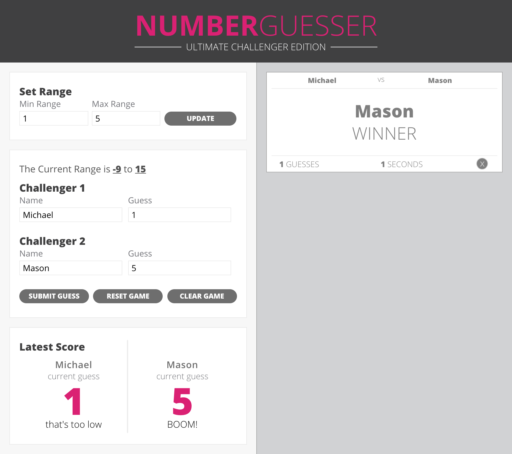

# Number Guesser
This website is a paired project for Turing School Module 1. We were challenged to replicate a comp and build in functionality using javaScript. The website itself is a game where two people submit guesses within a set range to try and be the first to guess a randomly generated number.

### Take aways
This project stretched our knowledge of javaScript. We built fluency with grabbing different elements on a page to give them functionality, such as input fields where we would move the entered value into a different part of the page, or use them in some way. For example, not only would the users input number range show up on our webpage, the values were needed to generate a random number between the min range and max range. Some of the other challenges we encountered were creating notifications or alerts for when the user had not entered a valid input for various fields.
We tried to push ourselves to research various aspects of the pages functionality, making sure we understood what we were finding. This included looking in to multiple ways to set a timer, figuring out how to track how many times a certain button had been clicked, and the generation of new HTML content using javaScript, in the form of an end-of-the-game card, showing the winner and several details about this game. This particularly proved to be a challenge as we had to think about how to make it dynamic, each subsequent card appearing with different information.
Overall, completing this project was very rewarding and helped us learn a lot about event listeners, changing elements and CSS properties through javaScript, and just bolstering our knowledge of how pieces fit together and interact with one another in javaScript.
## Images

### Static Composition

### My Assignment Screen Grab

